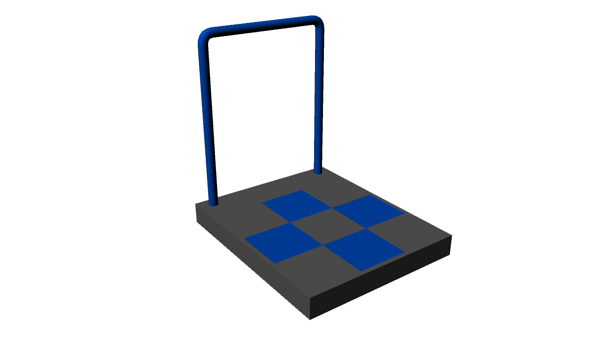
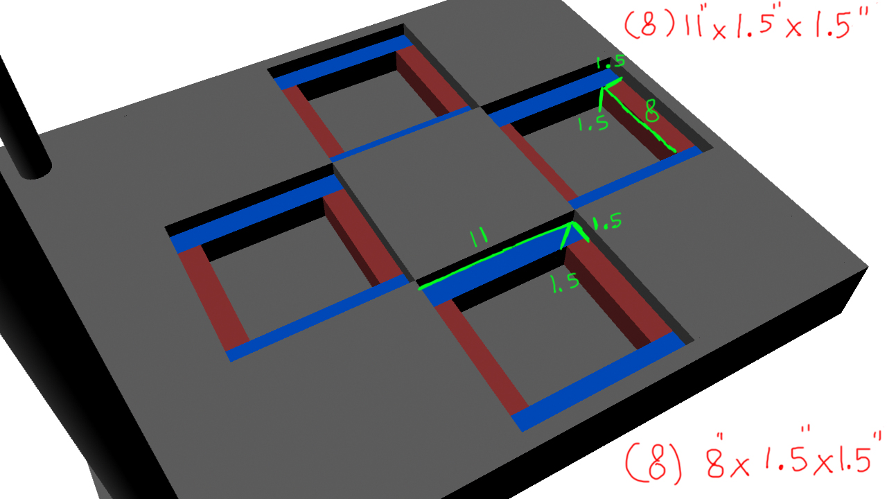
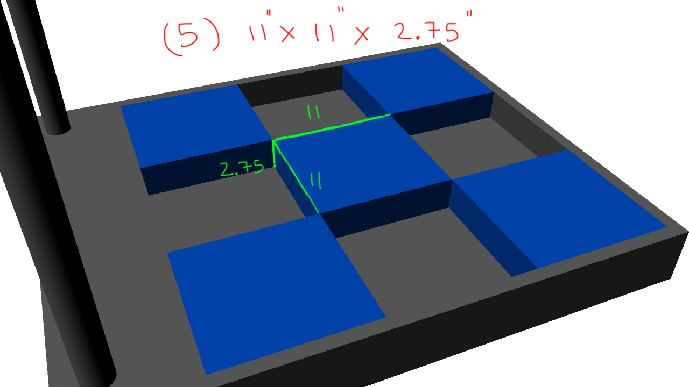
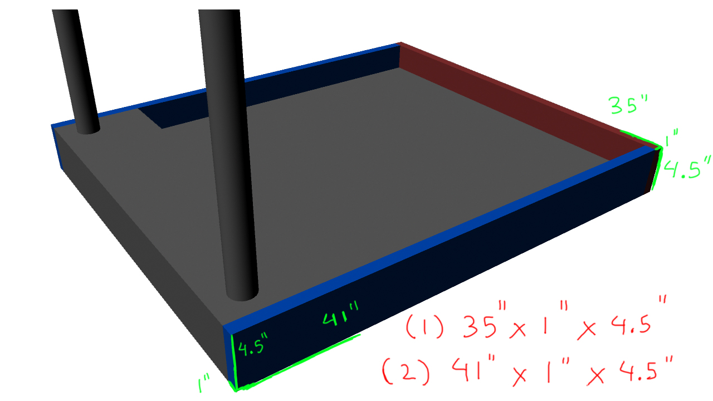
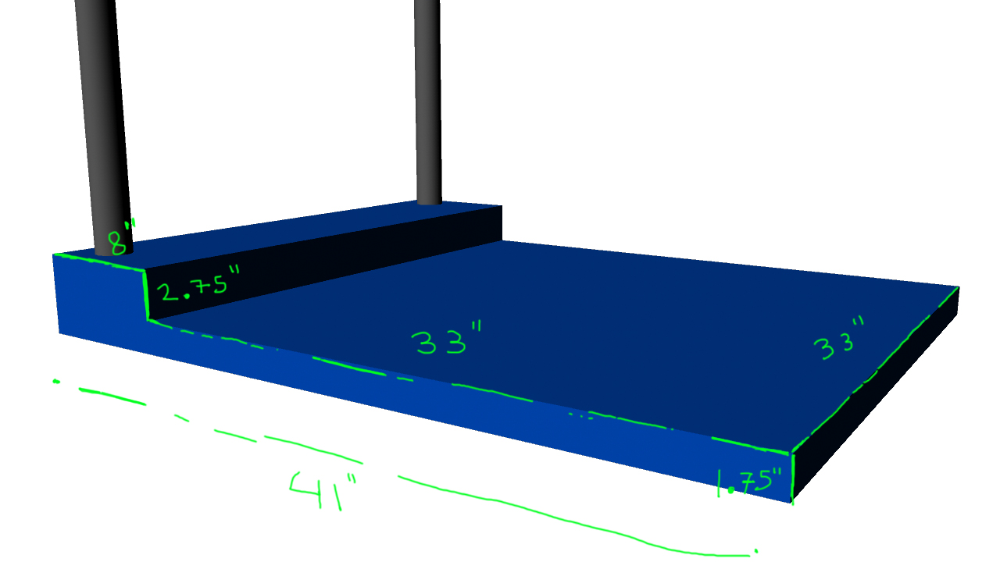
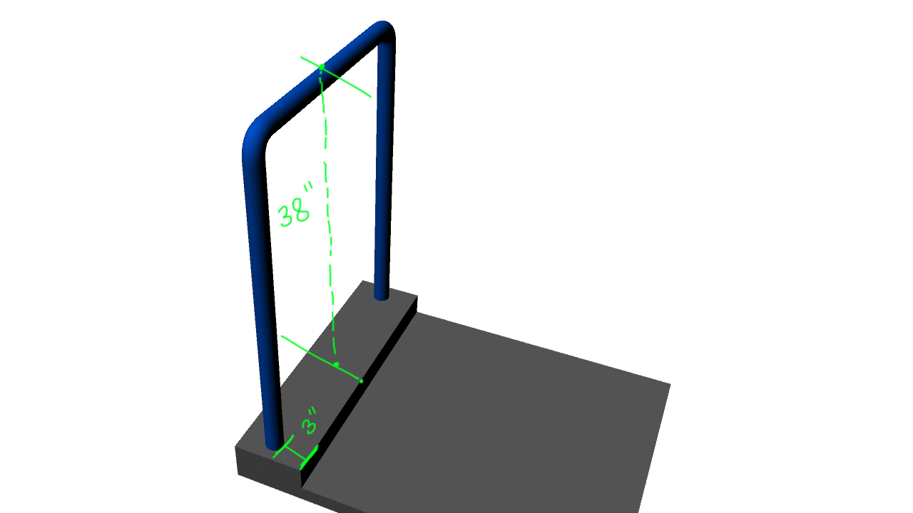
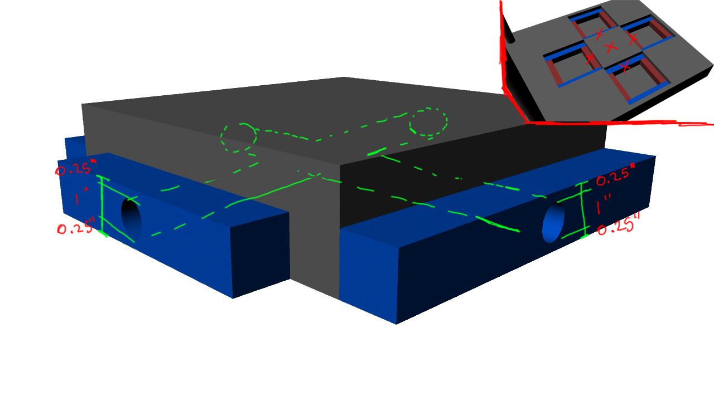

#ITG Renders

##Parts list
### (quantity) measurements in inches

* (1) Base
* (4) 11 x 11 x 1
* (8) 11 x 1.5 x 1.5
* (8) 8 x 1.5 x 1.5
* (5) 11 x 11 x 2.75
* (1) 35 x 1 x 4.5
* (2) 41 x 1 x 4.5

